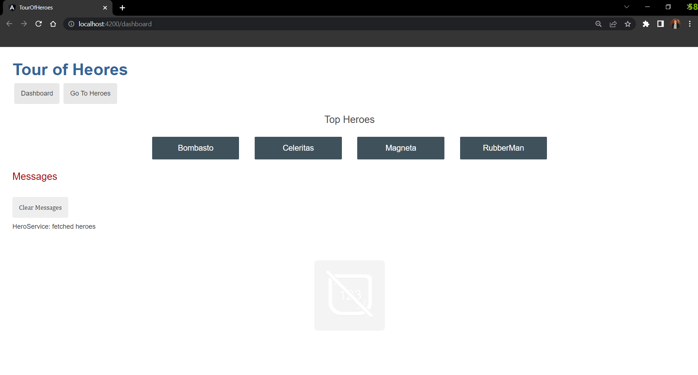
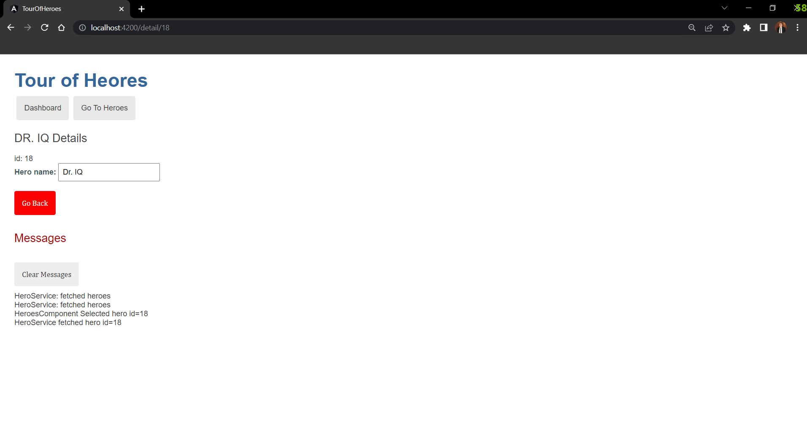
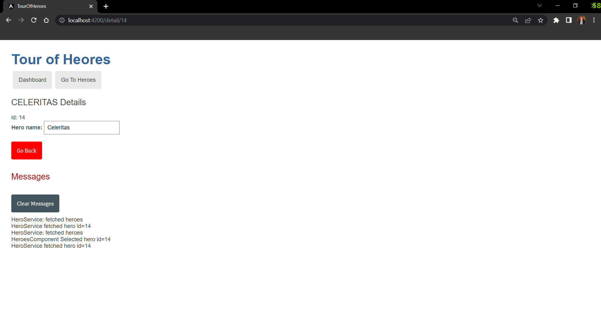
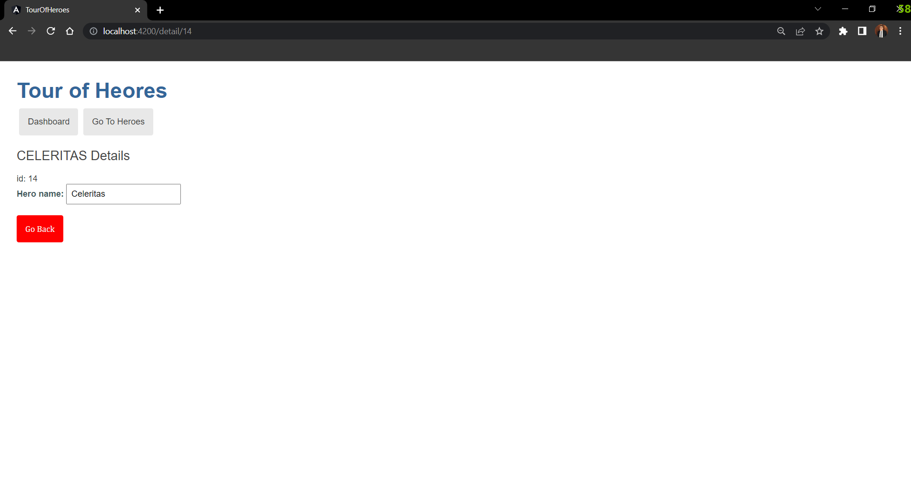

# Angular-Tour-of-Heores
The angular tutorial to learn angular framework and learning how, when and why to use interfaces, services, components, routing, observable, and data binding , using TypeScript.
this app shows list of heroes and by clicking on anyone of them it redirect us to the detail page for the selected hero , aslo it shows a message for every step we take in the site and we can clear the messages list

